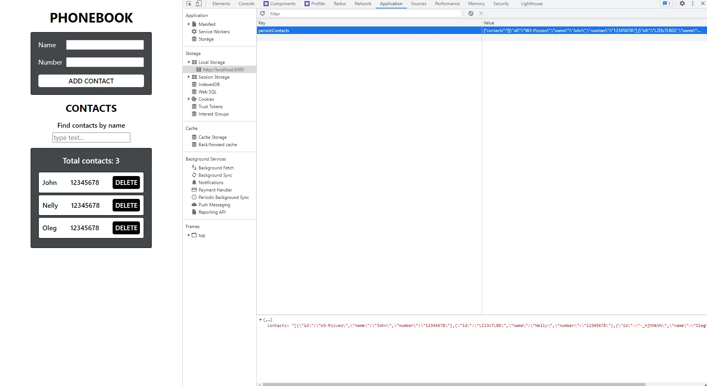

# React Phonebook with Redux Toolkit

## The code of this application was refactored: [phonebook](https://github.com/GnatykOleg/react-phonebook-start-with-hooks) using Redux Toolkit(createSlice()), Redux Persist, and React-Redux hooks.

#### The code of the application "Book of contacts" was refactored, and control was added state using the Redux Toolkit library. Redux state, looks like it in the following way.

`{ contacts: [], filter: "" } `

#### The store is created with configureStore() The createSlice() function is used. Created actions for saving and deleting a contact, as well as updating the filter React components with Redux logic using react-redux library hooks Used the Redux Persist library to save an array of contacts in local storage.

